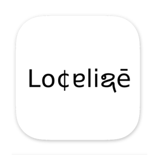
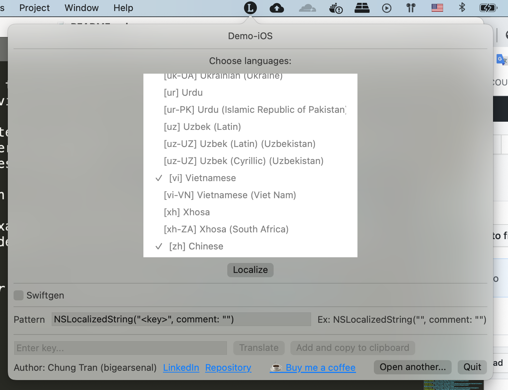
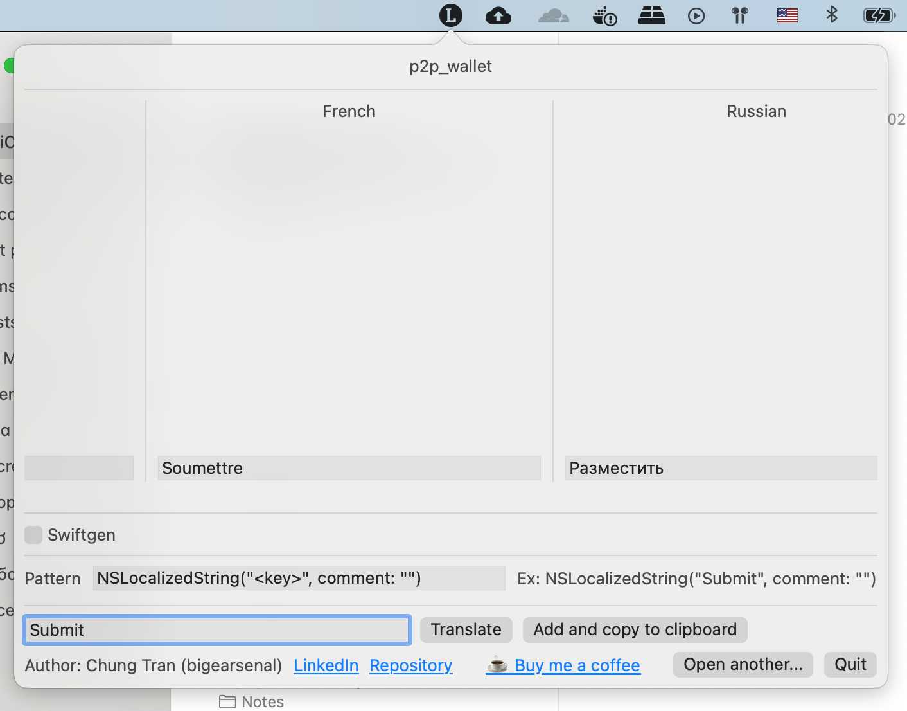
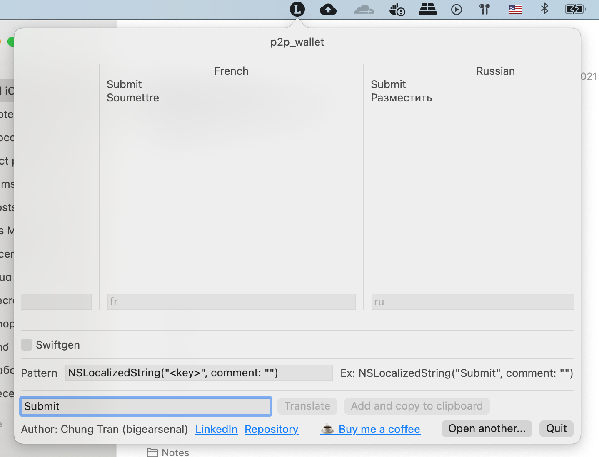

<!--
*** Thanks for checking out the Best-README-Template. If you have a suggestion
*** that would make this better, please fork the repo and create a pull request
*** or simply open an issue with the tag "enhancement".
*** Thanks again! Now go create something AMAZING! :D
-->

<!-- PROJECT SHIELDS -->
<!--
*** I'm using markdown "reference style" links for readability.
*** Reference links are enclosed in brackets [ ] instead of parentheses ( ).
*** See the bottom of this document for the declaration of the reference variables
*** for contributors-url, forks-url, etc. This is an optional, concise syntax you may use.
*** https://www.markdownguide.org/basic-syntax/#reference-style-links
-->
[![Contributors][contributors-shield]][contributors-url]
[![Forks][forks-shield]][forks-url]
[![Stargazers][stars-shield]][stars-url]
[![Issues][issues-shield]][issues-url]
[![MIT License][license-shield]][license-url]
[![LinkedIn][linkedin-shield]][linkedin-url]

<!-- PROJECT LOGO -->
 

  

  <h3 align="center">XCodeLocalizationHelper</h3>

  

    An awesome development tool for automating localization progress in your XCode Project!
     
    <!-- <a href="https://github.com/othneildrew/Best-README-Template"><strong>Explore the docs »</strong></a>
      -->
     
    <a href="https://youtu.be/i39IbtfR6Hc">View Demo</a>
    ·
    <a href="https://github.com/bigearsenal/XCodeLocalizationHelper/issues">Report Bug</a>
    ·
    <a href="https://github.com/bigearsenal/XCodeLocalizationHelper/issues">Request Feature</a>
  

<!-- TABLE OF CONTENTS -->

  
Table of Contents

  <ol>
    <li>
      <a href="#about-the-project">About The Project</a>
      <ul>
        <li><a href="#built-with">Built With</a></li>
      </ul>
    </li>
    <!--<li> 
      <a href="#getting-started">Getting Started</a>
      <ul>
        <li><a href="#prerequisites">Prerequisites</a></li> -->
        <li><a href="#installation">Installation</a></li>
      <!-- </ul>
    </li> -->
    <li><a href="#usage">Usage</a></li>
    <li><a href="#roadmap">Roadmap</a></li>
    <li><a href="#contributing">Contributing</a></li>
    <li><a href="#license">License</a></li>
    <li><a href="#contact">Contact</a></li>
    <!-- <li><a href="#acknowledgements">Acknowledgements</a></li> -->
  </ol>

<!-- ABOUT THE PROJECT -->
## About The Project

[![LocalizationHelper Screen Shot][product-screenshot]](https://github.com/bigearsenal/XCodeLocalizationHelper)

Localizing project is quite a hard and boring task in iOS/macOS application development process, so a lot of developers (me included) have skipped localizing during the first release of the app until the time when they are obligated to support multiple languages. And then the nightmare happens because they have to look for all strings and texts in UI, create strings files, translate each file (or send them to a translator).

There are some tools that help developers generate strings files like [stringsgen](https://stackoverflow.com/questions/44814429/xcode-8-generate-strings-file), or generate api for localization like [swiftgen](https://github.com/SwiftGen/SwiftGen). But these tools or these tools combined are simply just not enough, we still have to do a lot of works to make an awesome multilanguage-supported application.

Then XCodeLocalizationHelper (or LocalizationHelper) comes as a rescue.

Here's why:
* LocalizationHelper helps you set up your project for localization if it has not been supported yet.
* You can create and translate new keys for each Localizable.strings files in a blink of an eye with GoogleTranslate open API (steel works from your company's translators :smile:).
* You can edit the translation before adding to the project.
* You can immediately get the code you need in clipboard or using swiftgen for generating API after adding any key to your strings files using LocalizationHelper.
* See [demo](https://youtu.be/i39IbtfR6Hc).

So if you like this project, I kindly ask you to [buy me a coffee](https://www.buymeacoffee.com/bigearsenal). Your support would be highly appreciated.

<!-- A list of commonly used resources that I find helpful are listed in the acknowledgements. -->

### Built With

* [SwiftUI](https://developer.apple.com/xcode/swiftui/)
* [XcodeProj](https://github.com/tuist/XcodeProj)
* [GoogleTranslate](https://translate.google.com/)

<!-- GETTING STARTED -->
### Installation

Getting started by downloading the installer of [the latest version of the app](https://github.com/bigearsenal/XCodeLocalizationHelper/raw/features/README/release/LocalizationHelper.dmg).

Mount the .dmg file, copy it to your `~/Applications` folder, open it and you're ready to go.

<!-- USAGE EXAMPLES -->
## Usage

At the first time when you open the project, you will see the `Open a .xcodeproj file` button. Click it and open your `.xcodeproj` file.

If your project has not supported localization yet, then there will be a `Localize` button that helps you register your app for localization, add `knownRegions`, add `.lproj` folders and `Localizable.strings` files for these languages you choose.

After succesfully setting up your project for localization, you will see the main screen of application that helps you to add new keys and their translations to the relative `.strings` files.

You can now add some keys and translate them by clicking `Translate` button.

Choose `swiftgen` option if you are using swiftgen for creating strings API (the `swiftgen.yml` must be located at `$PROJECT_ROOT/swiftgen.yml` and `pod swiftgen` must be installed in your `Pods/`), or leave it unselected and choose the pattern you want when copying to clipboard.

And the string with pattern you entered will be copied to clipboard. For example: `NSLocalizedString("Submit", comment: "")`.

And that's it, you now can paste directly this text to your swift files!

_For more examples, See [demo](https://youtu.be/i39IbtfR6Hc)_

<!-- ROADMAP -->
## Roadmap

* Support `stringsdict`.
* Support edit existing key / value.
* Support adding, deleting new languages alongside existing languages.

See the [open issues](https://github.com/bigearsenal/XCodeLocalizationHelper/issues) for a list of proposed features (and known issues).

<!-- CONTRIBUTING -->
## Contributing

Contributions are what make the open source community such an amazing place to be learn, inspire, and create. Any contributions you make are **greatly appreciated**.

1. Fork the Project
2. Download and install `tuist`
3. Navigate to folder and run `tuist generate`
4. Create your Feature Branch (`git checkout -b feature/AmazingFeature`)
5. Commit your Changes (`git commit -m 'Add some AmazingFeature'`)
6. Push to the Branch (`git push origin feature/AmazingFeature`)
7. Open a Pull Request

<!-- LICENSE -->
## License

Distributed under the MIT License. See `LICENSE` for more information.

<!-- CONTACT -->
## Contact

Chung Tran - [twitter](https://twitter.com/bigearsenal) - bigearsenal@gmail.com

Project Link: [https://github.com/bigearsenal/XCodeLocalizationHelper](https://github.com/bigearsenal/XCodeLocalizationHelper)

<!-- ACKNOWLEDGEMENTS -->
<!-- ## Acknowledgements
* [GitHub Emoji Cheat Sheet](https://www.webpagefx.com/tools/emoji-cheat-sheet)
* [Img Shields](https://shields.io)
* [Choose an Open Source License](https://choosealicense.com)
* [GitHub Pages](https://pages.github.com)
* [Animate.css](https://daneden.github.io/animate.css)
* [Loaders.css](https://connoratherton.com/loaders)
* [Slick Carousel](https://kenwheeler.github.io/slick)
* [Smooth Scroll](https://github.com/cferdinandi/smooth-scroll)
* [Sticky Kit](http://leafo.net/sticky-kit)
* [JVectorMap](http://jvectormap.com)
* [Font Awesome](https://fontawesome.com) -->

<!-- MARKDOWN LINKS & IMAGES -->
<!-- https://www.markdownguide.org/basic-syntax/#reference-style-links -->
[contributors-shield]: https://img.shields.io/github/all-contributors/bigearsenal/XCodeLocalizationHelper?style=for-the-badge
[contributors-url]: https://github.com/bigearsenal/XCodeLocalizationHelper/graphs/contributors
[forks-shield]: https://img.shields.io/github/forks/bigearsenal/XCodeLocalizationHelper?style=for-the-badge
[forks-url]: https://github.com/bigearsenal/XCodeLocalizationHelper/network/members
[stars-shield]: https://img.shields.io/github/stars/bigearsenal/XCodeLocalizationHelper?style=for-the-badge
[stars-url]: https://github.com/bigearsenal/XCodeLocalizationHelper/stargazers
[issues-shield]: https://img.shields.io/github/issues/bigearsenal/XCodeLocalizationHelper?style=for-the-badge
[issues-url]: https://github.com/bigearsenal/XCodeLocalizationHelper/issues
[license-shield]: https://img.shields.io/github/license/bigearsenal/XCodeLocalizationHelper?style=for-the-badge
[license-url]: https://github.com/othneildrew/Best-README-Template/blob/master/LICENSE.txt
[linkedin-shield]: https://img.shields.io/badge/-LinkedIn-black.svg?style=for-the-badge&logo=linkedin&colorB=555
[linkedin-url]: https://www.linkedin.com/in/chung-tr%E1%BA%A7n-39b46569/
[product-screenshot]: images/screenshot.png
